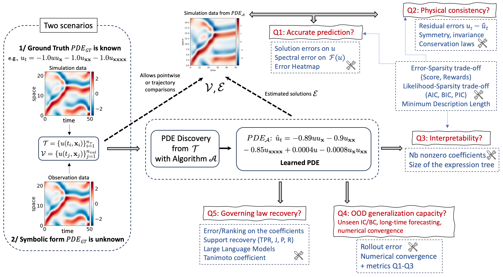
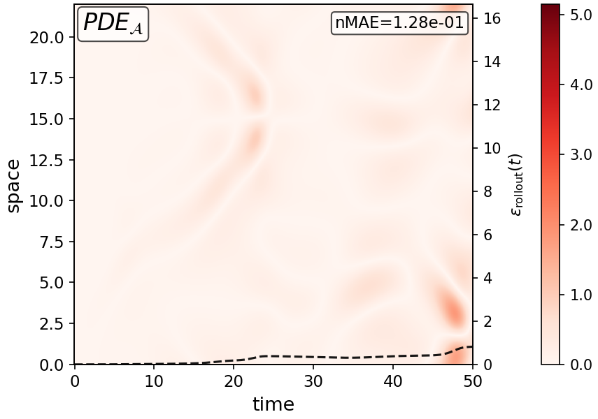
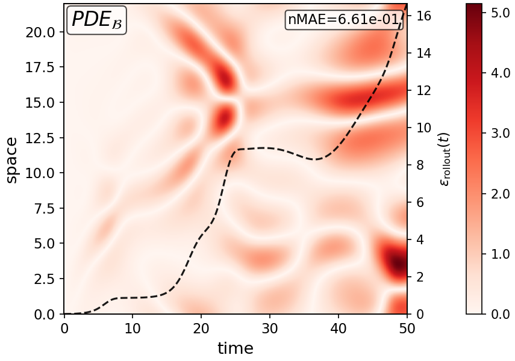
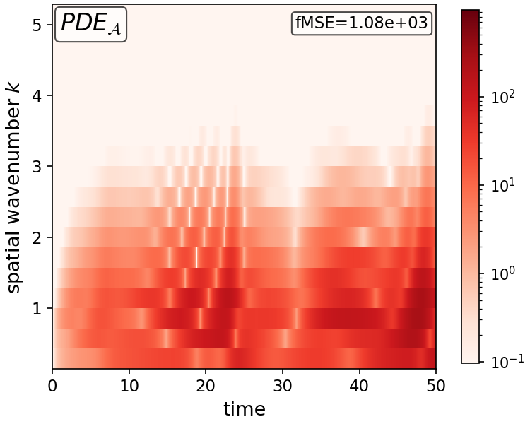
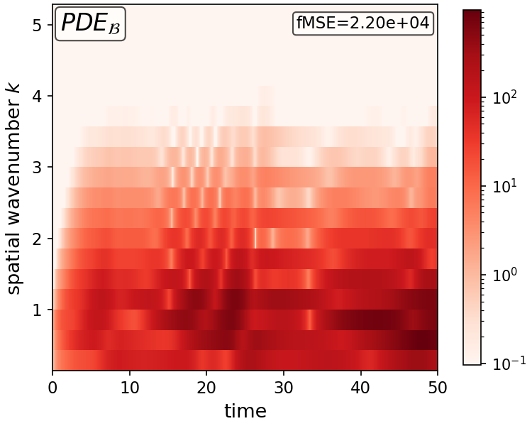

# PDE-Evaluation

Code associated with the paper:

> **On the post-hoc Evaluation of PDE Discovery: A Multifaceted Challenge of Scientific
> Advancement**
> Anonymous Author(s)

<details>
<summary><b>Abstract</b></summary>
<br>

Partial differential equation (PDE) discovery aims to identify from data the governing law of
a physical system. Constituting a cornerstone of scientific advancement, it has become during
the past decade a major line of research in the rapidly evolving field of Physics-informed
Machine Learning (PiML). Among the open problems to address in this domain, the post-hoc
evaluation of discovered PDEs raises the particular difficulty of being multifaceted. Indeed,
it requires jointly considering predictive accuracy, physical consistency, interpretability,
and out-of-distribution generalization capacity, some of these properties being conflicting,
Drawing on an extensive body of literature spanning machine learning, numerical analysis,
information theory, and symbolic regression, we establish in this article that the
overwhelming majority of papers address only certain aspects of the overall evaluation task.
To better understand their limitations when used in isolation from the others, we propose,
to our knowledge, the first taxonomy of PDE evaluation metrics. Through experiments conducted
on several PDEs, we observe that limiting the scope of the evaluation can lead to overstated
conclusions as well as changes in the ranking of the identified equations (and, consequently,
of the discovery algorithms). For this reason, we further provide recommendations with the aim
of promoting standardized and reliable practices. This results in the design of PDE-Check, a
simple rules-based protocol to guide practitioners according to the scenario under
consideration, including whether or not the ground truth equation is available (recovery or
discovery), whether data is available beyond the training time frame and/or under varying
initial conditions, or whether physical priors is available. We argue that this paper is
intended both for ML experts who design new PDE discovery algorithms and for users of these
methods aiming, in real applications, to discover and validate well-founded scientific laws.

</details>

Post-hoc evaluation of PDE discovery: a suite of metrics and diagnostic plots for assessing
the quality of a *discovered* PDE against a known ground-truth PDE.

Given a candidate equation, e.g. $u_t = -u u_x + 0.05 u_{xx}$, this repository simulates it,
compares it against the reference dynamics, and reports quantitative metrics (accuracy,
sparsity, coefficient recovery, generalization, trade-off scores) together with diagnostic
figures (solution fields, error heatmaps, spectral error, convergence curves).

The reference system's domain and initial condition are supplied by a config file (see
[Reference-system configs](#reference-system-configs)); ready-to-use configs are provided for
**Burgers' equation**, the **Korteweg-de Vries (KdV) equation**, the
**Kuramoto-Sivashinsky (KS) equation**, and the **advection-diffusion equation**.

This repository is primarily a reference **Python implementation of the metrics** from the
paper, meant to be read, reused, and adapted. It is not a turnkey tool for arbitrary PDEs:
the solver only covers 1D, periodic, spectrally-solvable systems (a linear operator up to
$u_{xxxx}$, plus polynomial nonlinearities and $x$-/$t$-linear terms), and writing a correct
config for a new system (domain, time step, initial condition) requires enough numerical
judgment to know the PDE actually needs (the config format won't catch a wrong choice).

### Open questions in the post-hoc evaluation of PDE discovery



## Repository structure

```
utils.py                       ETD2-RK spectral solver, PDE-file parsing, and config loading, shared by all entry points
configs/*.json                 reference-system configs (domain, IC) for burgers/kdv/ks/advection_diffusion
simulation.py                  entry point for figure generation
evaluation/evaluation.py       entry point for metric computation
evaluation/errors.py           accuracy metrics (MSE, nMAE, rollout error, ...)
evaluation/coef.py             coefficient-recovery metrics (NDCG, Tanimoto, ...)
evaluation/sparsity.py         sparsity and structural-complexity metrics
evaluation/terms.py            term-recovery and symbolic-equivalence metrics (TPR, precision, recall, TED, CAS)
evaluation/tradeoff.py         accuracy-sparsity trade-off metrics (AICc, BIC, MDL, ...)
evaluation/generalization.py   out-of-distribution and numerical-convergence metrics
evaluation/shared.py           helper routines shared across metric modules
evaluation/sensitivity.py      term-sensitivity weighting used by the wL2coef metric
datagen/generate.py            simulates a reference PDE and saves the trajectory as training data for discovery
algorithms/pdefind.py          PDE discovery via sparse regression (STLSQ)
algorithms/deepmod.py          PDE discovery via DeepMoD (neural network + sparse regression)
algorithms/utils.py            data loading and derivative helpers shared by pdefind.py/deepmod.py
algorithms/discovered_pde/     example PDEs discovered by pdefind.py and deepmod.py for each reference system
```

## PDE file format

A PDE is specified as a plain-text file listing its terms and coefficients:

```
u_xx: 0.05
u·u_x: -1.0
```

which corresponds to $u_t = 0.05 u_{xx} - u u_x$. Supported terms are `u`, `u_x`, `u_xx`,
`u_xxx`, `u_xxxx` (linear terms); products of two or more such terms (e.g. `u·u_x`,
`u·u·u_xx`); `x·u_xx`- and `t·u_xx`-style terms (a linear term multiplied by the spatial or
temporal coordinate); and repeated-factor products written with a superscript instead of a
literal product, e.g. `u²·u_xx` for `u·u·u_xx`. A constant offset may be specified with
`b: <value>`. Standalone coordinate terms (`x`, `t`, `x·x`, `t·t`, `x·t`) are parsed and
dropped with a warning, since they aren't part of the candidate dictionary. PDEs are simulated
with a 2nd-order ETD-RK (Cox & Matthews) integrator.

Filenames carry no meaning, only a file's *contents* need to follow the format above. By
convention, files live under `pde_files/<system>/` (e.g. `pde_files/ks/`), since the
containing directory is used to label output files (`simulations/<system>/...`); the
ground-truth file itself must always be given explicitly via `--fileGT`.

## Reference-system configs

`--fileGT` supplies the PDE, but not the domain it's simulated on or its initial condition,
that comes from a separate config file, always given via `--config`. The solver itself
(`utils.py`) has no PDE- or system-specific code at all: a config is a JSON file giving the
domain (`N`, `L`, `dt`, `T`, `default_nt`) and the initial condition `u0(x, L)` as a plain math
formula (`ic`, evaluated with `sympy`), never Python code. Ready-to-use configs for the four
reference systems are in `configs/`:

```json
{
  "name": "ks",
  "N": 220,
  "L": 22.0,
  "dt": 0.01,
  "T": 50.0,
  "default_nt": 5001,
  "ic": "cos(2*pi*x/L) + 0.5*cos(4*pi*x/L + 0.3)"
}
```

For initial conditions built from intermediate quantities, add `ic_params` (scalar constants,
literal or a formula over `x`/`L`/earlier params) and `ic_vars` (array expressions over
`x`/`L`/params/earlier vars); `ic` is evaluated last. See `configs/kdv.json` for a two-soliton
example using both.

## Discovering PDEs

Everything above assumes you already have a candidate PDE file. If you want to see the whole
pipeline, simulate a system, discover a PDE from that data, then evaluate it, `datagen/` and
`algorithms/` cover the first two steps.

`datagen/generate.py` simulates one of the reference systems and saves the trajectory as an
`.npz` file:

```
python3 datagen/generate.py --pde ks --dx 0.1 --dt 0.01
```

`--dx`/`--dt` control the resolution, `--T` overrides the config's default simulation time. The
output goes to `datagen/<pde>.npz` by default (change with `--output`), alongside a plot of the
simulated field.

Two discovery algorithms read that `.npz` and try to recover the governing equation, writing it
out in the same PDE-file format used everywhere else in this repo:

```
python3 algorithms/pdefind.py --data datagen/ks.npz
python3 algorithms/deepmod.py --data datagen/ks.npz
```

`pdefind.py` is sparse regression (STLSQ) via [PySINDy](https://github.com/dynamicslab/pysindy):
it builds a fixed dictionary of candidate terms and solves for a sparse coefficient vector.
`deepmod.py` is [DeepMoD](https://github.com/PhIMaL/DeePyMoD):
a neural network learns the solution field, and the same kind of dictionary is fit on its
derivatives (via automatic differentiation). Both
default to per-system settings (subsampling stride, sparsity threshold, ...) tuned for
burgers/kdv/ks/advection_diffusion; pass `--data` with any other `.npz` and they fall back to
generic defaults. See `--help` on each script for the full list of options (dictionary terms,
regularization strength, network size, training length, ...).

`algorithms/discovered_pde/` has example outputs from both algorithms on all four reference
systems, ready to plug into `--file` below.

## Computing metrics

```
cd evaluation
python3 evaluation.py --file ks_pde_A.txt --fileGT ks_pde_true.txt --config ../configs/ks.json --metric all
```

This simulates the ground truth given by `--fileGT` (on the domain/IC given by `--config`) and
the candidate `ks_pde_A.txt`, then reports every registered metric. `--fileGT` and `--file`
accept any filename; a bare name (no path) is first looked for as-is, then under the ground
truth's directory.

Multiple candidates may be evaluated against the same ground truth in one call:

```
python3 evaluation.py --file ks_pde_A.txt ks_pde_B.txt --fileGT ks_pde_true.txt --config ../configs/ks.json --metric all
```

Individual metrics can be selected in place of `all`, either by name or by module (which
expands to all metrics defined in that module):

```
python3 evaluation.py --file ks_pde_A.txt --fileGT ks_pde_true.txt --config ../configs/ks.json --metric MSE rollout Sterms
python3 evaluation.py --file ks_pde_A.txt --fileGT ks_pde_true.txt --config ../configs/ks.json --metric errors coef
```

Some metrics require additional arguments; the script reports which one is missing if omitted:

```
python3 evaluation.py --file ks_pde_A.txt ks_pde_B.txt --fileGT ks_pde_true.txt --config ../configs/ks.json --metric Sterms --theta_size 5
python3 evaluation.py --file ks_pde_A.txt ks_pde_B.txt --fileGT ks_pde_true.txt --config ../configs/ks.json --metric Score --baseline_file ks_pde_A.txt
```

If a single system name is given instead of a filename, every `*.txt` file found under
`pde_files/<system>/` (besides `--fileGT`) is evaluated against the ground truth:

```
python3 evaluation.py --file ks --fileGT ks_pde_true.txt --config ../configs/ks.json --metric all --theta_size 5 --baseline_file ks_pde_A.txt
```

Additional options include `--dt_factor` (finer internal time-stepping), `--T_max`
(overrides the config's default simulation horizon), `--k_max` (spectral cutoff for fMSE),
`--ic` (choice of out-of-distribution initial condition for `IC_nMAE`/`rollout_IC`), and `--n_refine`
(number of refinement steps for `Conv_t`/`Conv_x`). See `python3 evaluation.py --help` for the
complete list.

## Generating figures

```
python3 simulation.py --file ks_pde_A.txt --fileGT ks_pde_true.txt --config configs/ks.json
```

Produces a side-by-side comparison of the ground truth and candidate solution fields, a
solution heatmap, and an error heatmap, written to `simulations/` and `errors/`.

Example rollout-error (`--rollout`) and Fourier-space error (`--fourier`) plots for two KS candidates:

<p>




</p>

Additional options:

```
python3 simulation.py --file ks_pde_A.txt ks_pde_B.txt --fileGT ks_pde_true.txt --config configs/ks.json --eq_title      # annotate each panel with its equation
python3 simulation.py --file ks_pde_A.txt --fileGT ks_pde_true.txt --config configs/ks.json --rollout --rollout_t 300    # rollout-error plot, reported at t=300
python3 simulation.py --file ks_pde_A.txt --fileGT ks_pde_true.txt --config configs/ks.json --fourier --fourier_log      # spectral (Fourier-space) error heatmap
python3 simulation.py --file ks_pde_A.txt --fileGT ks_pde_true.txt --config configs/ks.json --conv --n_refine 6          # numerical convergence plots
python3 simulation.py --file ks --fileGT ks_pde_true.txt --config configs/ks.json --clean                                # all candidates for a system, unlabeled axes
python3 simulation.py --file ks_pde_A.txt --fileGT ks_pde_true.txt --config configs/ks.json --vmax_diff 2.0               # fix the error heatmap's color scale instead of auto-scaling to the candidate's max
python3 simulation.py --file ks_pde_A.txt --fileGT ks_pde_true.txt --config configs/ks.json --rollout_on_sim              # overlay the rollout-error curve on the solution plot
python3 simulation.py --file ks_pde_A.txt --fileGT ks_pde_true.txt --config configs/ks.json --plot_rollout_error          # overlay the rollout-error curve on the error heatmap
```

## Requirements

`numpy`, `matplotlib`, `sympy`. `evaluation/sensitivity.py` additionally requires `jax`, used
only by the `wL2coef` metric.

## List of metrics

Notation follows the paper: $u$ and $\hat{u}$ are the ground-truth and candidate solution
fields, $\alpha$ and $\hat{\alpha}$ their coefficient vectors, $\Theta$ the candidate term
dictionary, and $\mathcal{S}(\hat{\alpha}) = \{\Theta_i : \hat{\alpha}_i \neq 0\}$ the
candidate's active terms.

| Metric | Module | Formula | Description |
|---|---|---|---|
| `MSE` | `errors` | $\frac{1}{n}\sum_i (\hat u_i - u_i)^2$ | Mean squared error between candidate and ground-truth solutions |
| `nMSE` | `errors` | $\frac{\sum_i (\hat u_i - u_i)^2}{\sum_i u_i^2}$ | MSE normalized by the ground truth's squared magnitude |
| `nMSE_ubar` | `errors` | $\frac{\sum_i (\hat u_i - u_i)^2}{\sum_i (u_i - \bar u_i)^2}$ | `nMSE` with the denominator centered on the ground truth's spatial mean $\bar u$ at each time |
| `nMAE` | `errors` | $\frac{\sum_i \lvert \hat u_i - u_i \rvert}{\sum_i \lvert u_i \rvert}$ | Mean absolute error normalized by the ground truth's magnitude |
| `n_utMSE` | `errors` | $\frac{\sum_i (\hat u_{t,i} - u_{t,i})^2}{\sum_i u_{t,i}^2}$ | Normalized MSE on the residual $u_t$ (RHS) instead of $u$ |
| `fMSE` | `errors` | $\frac{1}{N_T}\sum_t \frac{\sum_{k} \lvert \mathcal{F}(\hat u)(t,k) - \mathcal{F}(u)(t,k) \rvert^2}{k_{max}-k_{min}+1}$ | Mean squared error in Fourier space, over the meaningful wavenumber band |
| `rollout` | `errors` | $\frac{1}{N_T}\sum_{i=1}^{N_T} \lVert \hat u(i\delta_t,\cdot) - u(i\delta_t,\cdot) \rVert_{L^2(\Omega)}^2$ | Time-averaged L2 error between candidate and ground-truth trajectories |
| `nL2coef` | `coef` | $\frac{\lVert \alpha - \hat\alpha \rVert_2^2}{\lVert \alpha \rVert_2^2}$ | Normalized L2 error between candidate and ground-truth coefficient vectors |
| `nL1coef` | `coef` | $\frac{\lVert \alpha - \hat\alpha \rVert_1}{\lVert \alpha \rVert_1}$ | Normalized L1 error between candidate and ground-truth coefficient vectors |
| `maxerror` | `coef` | $\max_{i:\alpha_i \neq 0} \frac{\lvert \alpha_i - \hat\alpha_i \rvert}{\lvert \alpha_i \rvert}$ | Largest relative coefficient error over the ground truth's nonzero terms |
| `NDCG` | `coef` | $\frac{DCG(rank(\hat\alpha))}{DCG(rank(\alpha))}$, with $DCG(r) = \sum_i \frac{r_i}{\log_2(i+1)}$ | Ranking similarity of coefficient magnitudes (discounted cumulative gain ratio) |
| `wL2coef` | `coef` | $\frac{\sum_i w_i(\alpha_i - \hat\alpha_i)^2}{\sum_i w_i}$, with $w_i \propto \lVert \partial u/\partial \alpha_i \rVert_2^2$ | L2 coefficient error weighted by each term's sensitivity |
| `Tanimoto` | `coef` | $\frac{\alpha^\top \hat\alpha}{\lVert \alpha \rVert_2^2 + \lVert \hat\alpha \rVert_2^2 - \alpha^\top \hat\alpha}$ | Tanimoto/Jaccard-style similarity between coefficient vectors |
| `Sterms` | `sparsity` | $1 - \frac{\lvert \{ \hat\alpha_i = 0 \} \rvert}{\lvert \Theta \rvert}$ (or $\infty$ if $\hat\alpha = 0$) | Fraction of nonzero coefficients relative to the full candidate dictionary |
| `ExpTree` | `sparsity` | $size\left(ExpTree(\hat\alpha^\top \Theta)\right)$ | Size (node count) of the equation's expression tree |
| `ExpTreeV2` | `sparsity` | $w_1 NbNodes\left(ExpTree(\hat\alpha^\top \Theta)\right) + w_2 Depth\left(ExpTree(\hat\alpha^\top \Theta)\right) + w_3 OperatorWeight\left(ExpTree(\hat\alpha^\top \Theta)\right)$ | Weighted combination of node count, tree depth, and operator weight (`--w1`/`--w2`/`--w3`, default 1.0 each) |
| `TPR` | `terms` | $\frac{TP}{TP+FN+FP}$ | Jaccard-style true-positive rate over the candidate's active-term support |
| `Precision` | `terms` | $\frac{TP}{TP+FP}$ | Fraction of the candidate's active terms that are correct |
| `Recall` | `terms` | $\frac{TP}{TP+FN}$ | Fraction of the ground truth's active terms recovered by the candidate |
| `TED` | `terms` | $\frac{dist(ExpTree(\hat\alpha^\top \Theta), ExpTree(\mathcal{N}[u]))}{size(ExpTree(\hat\alpha^\top \Theta)) + size(ExpTree(\mathcal{N}[u]))}$ | Normalized tree edit distance between the candidate and ground-truth expression trees |
| `CAS` | `terms` | $1$ if a CAS finds $\hat\alpha^\top\Theta - \mathcal{N}[u] = c_0$ or $\hat\alpha^\top\Theta / \mathcal{N}[u] = c_1 \neq 0$, else $0$ | Symbolic equivalence up to an additive or multiplicative constant |
| `Score` | `tradeoff` | $\frac{-\Delta \log(nMAE)}{\Delta C}$ | Accuracy-per-complexity gain of the candidate relative to a baseline PDE |
| `Reward1` | `tradeoff` | $\left(1 - c_0 \log_{10}\lvert \mathcal{S}(\hat\alpha) \rvert\right) \times \left(1 - \frac{\sum_i (u_{t,i} - \Theta_i^\top \hat\alpha)^2}{\sum_i (u_{t,i} - \bar u_t)^2}\right)$ | Sparsity-weighted R² fit on the $u_t$ residual |
| `Reward2` | `tradeoff` | $\frac{1 - \xi_1 \lvert \mathcal{S}(\hat\alpha) \rvert - \xi_2 depth(ExpTree(\hat\alpha^\top \Theta))}{1 + \lVert u_t - \hat\alpha^\top \Theta \rVert_2^2}$ | Sparsity/depth-penalized inverse residual error |
| `AICc` | `tradeoff` | $n \log \frac{\lVert u_t - \Theta^\top \hat\alpha \rVert_2^2}{n} + 2\lvert \mathcal{S}(\hat\alpha) \rvert$ | Corrected Akaike Information Criterion (fit vs. sparsity trade-off) |
| `BIC` | `tradeoff` | $\log(n)\lvert \mathcal{S}(\hat\alpha) \rvert - 2\log(L(\mathcal{T},\hat\alpha))$ | Bayesian Information Criterion (fit vs. sparsity trade-off) |
| `MDL_Fey` | `tradeoff` | $\log_2 N(\hat\alpha) + \lambda \log_2\left[\max\left(1, \frac{err(\hat\alpha)}{\epsilon_d}\right)\right]$ | AI-Feynman-style minimum description length score |
| `MDL_Sym` | `tradeoff` | $-\log p(\mathcal{T} \mid e(\Theta^\top \hat\alpha)) + \lambda len\left(ExpTree(\Theta^\top \hat\alpha)\right)$ | SymLang-style minimum description length score |
| `IC_nMAE` | `generalization` | $nMAE(\hat u, u)$ resimulated under an out-of-distribution initial condition | nMAE between candidate and ground truth under an unseen initial condition |
| `rollout_IC` | `generalization` | $\frac{1}{N_T}\sum_{i=1}^{N_T} \lVert \hat u(i\delta_t,\cdot) - u(i\delta_t,\cdot) \rVert_{L^2(\Omega)}^2$ resimulated under a chosen (`--ic`) initial condition | Rollout error between candidate and ground truth, both started from a chosen (possibly out-of-distribution) initial condition |
| `Conv_t` | `generalization` | $\lim_{\delta_t \rightarrow 0} \lVert \hat u - \hat u_{\delta_t} \rVert$ | Numerical convergence of the candidate PDE as the time step shrinks |
| `Conv_x` | `generalization` | $\lim_{\delta_x \rightarrow 0} \lVert \hat u - \hat u_{\delta_x} \rVert$ | Numerical convergence of the candidate PDE as the spatial grid is refined |

Each module name above can be passed directly to `--metric` to select all of its metrics at
once (e.g. `--metric errors`), as described in [Computing metrics](#computing-metrics).
